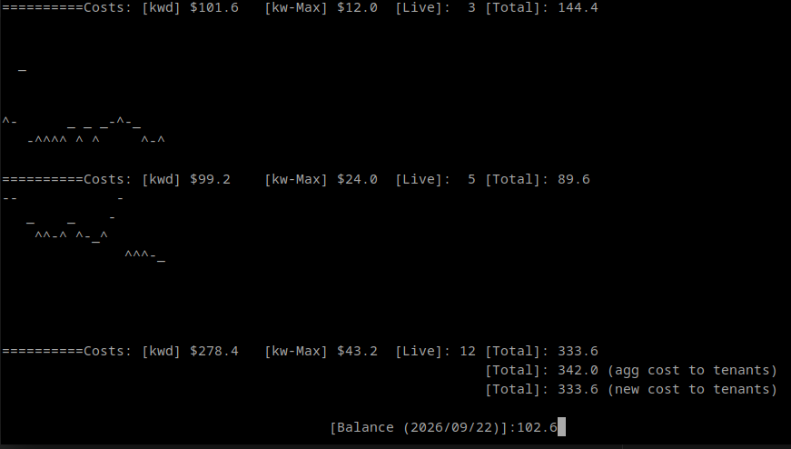
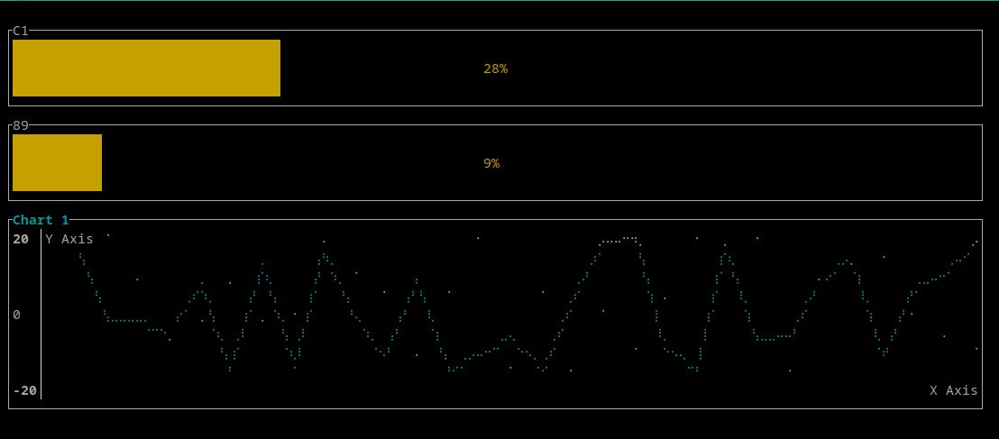

# Fair Share Meters

# Table of Contents

1. [What is this?](#what-is-this)
2. [The Python Code](#the-python-code)
3. [The Rust Code](#the-rust-code)
4. [Conclusion](#conclusion)
5. [Other Ideas](#other-ideas)

[Running the Python verison](#running-the-python-version)
[Running the Rust verison](#running-the-rust-version)

## What is this?

This project is about creating a more precise and equitable method of distributing energy costs among tenants, 
factoring in aspects like demand spikes and ratchet charges. 
It involves capturing data on energy usage, particularly during peak times, 
and using weighted sums to ensure fair billing. Here are some potential names for this project:

### The backstory

Someone asked me if there was a way to distribute energy costs among tenants
in a more precise manner. They explained a couple of things to consider, such as
demand spikes and ratchet charges. 

The way tenants were being billed for energy did
not accurately reflect their energy usage; there were a couple of loose ends that I can't remember. What
I do remember was that I thought of a better way and wanted to see it in action.

Generally speaking, I wanted to capture information about demand spikes and break that information down
into weighted sums. The weighted sums could then be used for more accurate billing to customers.

## The Python Code

I coded up a solution written in Python. I decided to output visuals using print and basically
printing out entire lines in order to depict moving line graphs. The lines illustrate
energy usage, sometimes there will be spikes. The energy usage is all randomly generated.

The first iteration of this simulator was kind of ugly and messy. The second time I came back to this project; I went back and cleaned up the code;
made it more OOP wherever I could.

I had a lot of fun implementing this and just watching the visuals run. There are balance amounts
for the tentants and you can see their account balances go up and down and everything just balances itself
cyclically. The simulation assumes all tenants pay their bills on time. The master account then uses that money
and pays the energy cost.

## The Rust Code

I had been seeing a lot of hype about Rust but didn't have reason to explore it but that changed when I came across
a project called [tui-rs](https://github.com/fdehau/tui-rs), I thought it looked awesome and
quickly thought about my energy costs simulator. So I went for it and started
implementing the simulator in Rust. I learned a thing or two and was able to get it running. There are some things
that need improvement, like for example, the memory management. I don't remember writing code for clearing out the randomly
generated values. I also did not implement all the visuals I wanted; it's missing all the stats. I probably need to refactor the visuals
part to make it less redundant. It's very declarative, so I found it kind of tedious to fill everything out.

## Conclusion

I'm writing all this now about 4 months since I wrote the Rust code, so I might be getting some stuff wrong.
I understood most of what I was coding in Rust along with its concepts. Rust basically wants to keep all the variables
you're working with in the same frame at all times; this is why function call arguments have to be marked as borrowed.
It's a way of enforcing encapsulation and makes it easier to debug. 

I'm a big fan of encapsulation; when I debug in
Python, I sometimes bring objects into the current frame just so I can observe them more easily instead of having to
navigate the frame stack or having to look for them in the 'self' or hidden/special properties.

One thing I found interesting is that at one point I tried passing an object into itself and this caused a compile error. 
I didn't look too much into it; found a workaround; or I guess the right way of doing things. I also found it interesting
that there is no inheritance in Rust so it required me to make the code more composable. I was basically declaring
outlines of encapsulations; encapsulating structures within structures. In Python I could have base classes and
extend them to have more specific properties or methods; in Rust I found I had to wrap things up with an outer struct if
I wanted to "extend" something.

Overall this was a nice project to work on for getting to know some Rust. Being able to use tui-rs was a big motivator
to work on this.

## Other Ideas

If I had more time to work on this I would finish up the visuals. The Rust version doesn't show any of the numerical stats.
I would also maybe create a configuration menu for various options.

If I had even way more time; It'd be cool to extend it into a small game where the building experiences power outages and
the player has to buy backup generators or you can upgrade the building to be more energy efficient; basically
make the program into more of an actual simulator.

## Running the Python verison
`python metering.py`

## Running the Rust verison
`cargo run`
